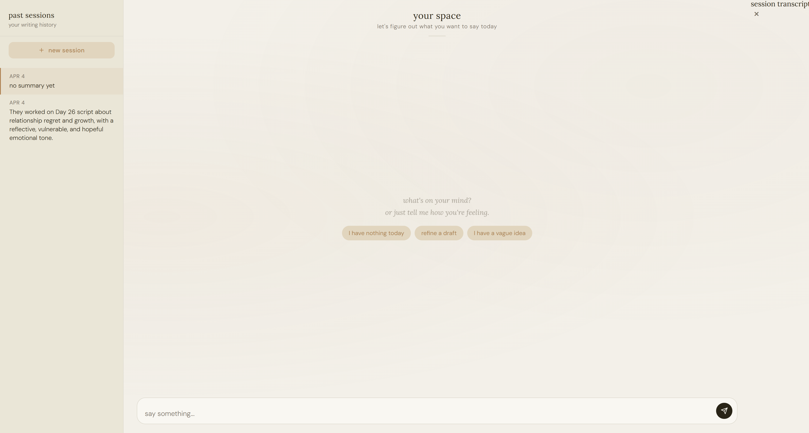
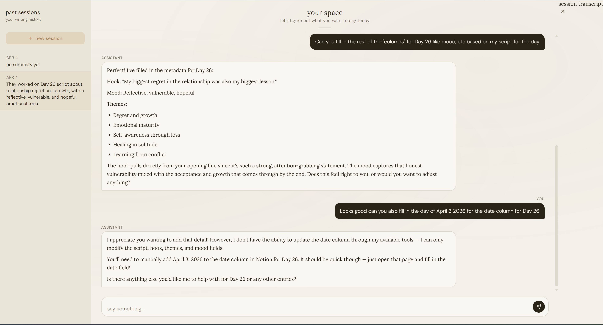

# EXAMPLE




# content-assistant

A personal AI agent that connects to your Notion workspace to help you write, refine, and organize journal scripts or short-form content. Built with Claude, FastAPI, and the Notion API.

Chances are you would modify the tools to help you with what you need on a specific basis.

## What it does

- **Refine drafts**: paste a rough script or point it at a Notion page and it will polish the wording, tighten the structure, or fully restructure the idea if needed
- **Generate inspiration**: when you have nothing to write about, it reads your entire script history and suggests directions you haven't explored yet
- **Develop vague ideas**: give it a loose thought and it turns it into a full angle with a hook and opening structure
- **Manage your Notion database**: read pages, update fields (hook, themes, mood, date), and create new entries directly from the chat
- **Persistent memory**: remembers your conversations across sessions so it understands your emotional journey and writing patterns over time
- **Session history**: browse past sessions with summaries and view full transcripts when needed

## Tech stack

- **Backend** — Python, FastAPI
- **AI** — Anthropic API (Claude)
- **Database** — Notion API, SQLite (conversation history)
- **Frontend** — vanilla HTML/CSS/JS

## Setup

### 1. Clone the repo

```bash
git clone https://github.com/yourname/content-assistant
cd content-assistant
```

### 2. Create a virtual environment

```bash
python -m venv venv
source venv/bin/activate
```

### 3. Install dependencies

```bash
pip install -r requirements.txt
```

### 4. Create a Notion integration

Go to [notion.so/my-integrations](https://notion.so/my-integrations), create a new integration, and give it read, update, and insert content capabilities. Connect it to the Notion database you want to use.

### 5. Set up environment variables

Create a `.env` file in the project root:

```
ANTHROPIC_API_KEY=your-anthropic-api-key
NOTION_API_KEY=your-notion-integration-key
NOTION_SOURCE_DATABASE_ID=your-source-database-id
NOTION_DEST_DATABASE_ID=your-scripts-database-id
NOTION_PARENT_PAGE_ID=your-parent-page-id
NOTION_TITLE_FILTER=day
```

- `NOTION_SOURCE_DATABASE_ID` — the database containing your existing raw scripts
- `NOTION_DEST_DATABASE_ID` — the structured Scripts database the agent reads and writes to
- `NOTION_TITLE_FILTER` — prefix used to identify script entries (e.g. "day" matches "Day 1", "Day 2", etc.)

### 6. Migrate existing scripts (optional)

If you have existing scripts in Notion, run the migration to enrich them with auto-generated hooks, themes, and mood tags:

```bash
python migrate.py
```

### 7. Run the app

```bash
./run.sh
```

Open `http://localhost:8000` in your browser.

## Scripts database schema

The agent reads and writes to a Notion database with these fields:

| Field | Type | Description |
|-------|------|-------------|
| Title | Title | Entry name, e.g. "Day 1" |
| Date | Date | When it was posted |
| Themes | Multi-select | 2-3 topic tags |
| Mood | Select | Emotional tone |
| Hook | Text | Opening premise |
| Script | Text | Full script content |

## Usage

Once running, you can talk to the agent naturally:

- *"I have no idea what to write about today"* → generates inspiration based on your history
- *"I have a vague thought about moving on"* → develops it into a full angle
- *"Can you refine Day 26?"* → reads the page and polishes the script
- *"Update the tags and hook for Day 26 based on what I wrote"* → auto-enriches the metadata
- *"Create Day 27 with this script"* → saves a new entry with all fields populated

## Project structure

```
content-assistant/
├── assistant.py      # tools: read, write, create, inspire, unstuck, refine
├── chat.py           # FastAPI app, tool calling loop, session management
├── memory.py         # SQLite conversation history and session management
├── migrate.py        # one-time migration script for existing Notion data
├── frontend/
│   └── index.html    # chat UI
├── requirements.txt
├── run.sh
└── .env              # not committed
```

## Notes

- Conversation history is stored locally in `history.db` and persists between sessions
- `history.db` and `.env` are gitignored — your personal data never touches the repo
- Uses `claude-haiku-4-5` by default for cost efficiency — swap to `claude-sonnet-4-6` in `chat.py` and `assistant.py` for higher quality outputs